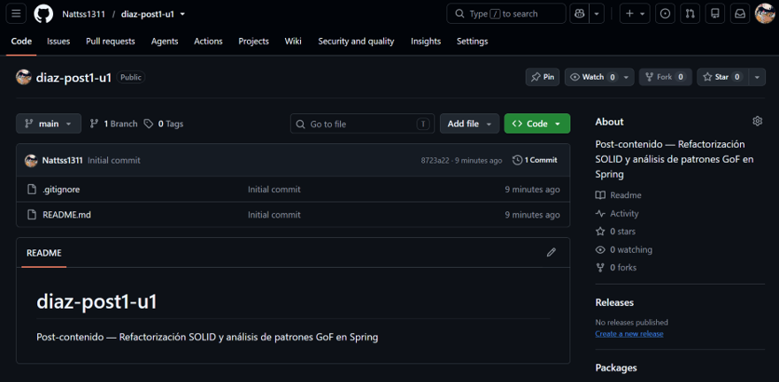
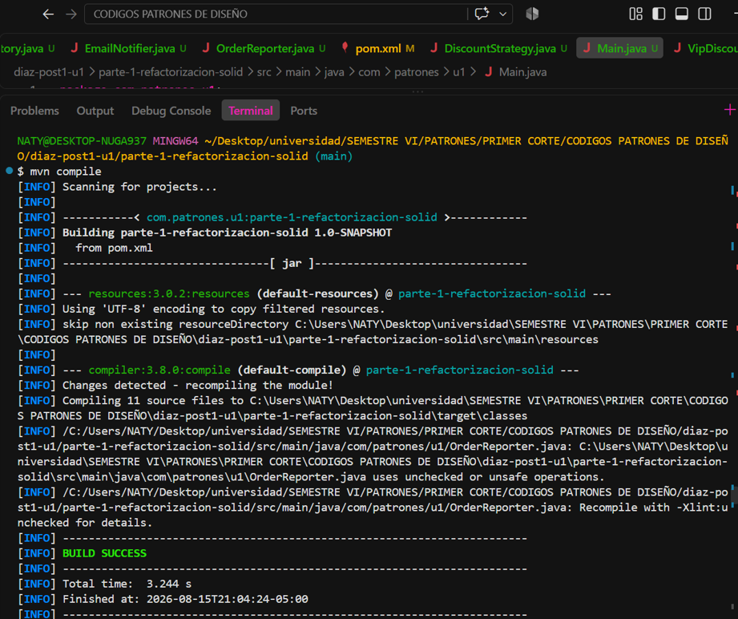
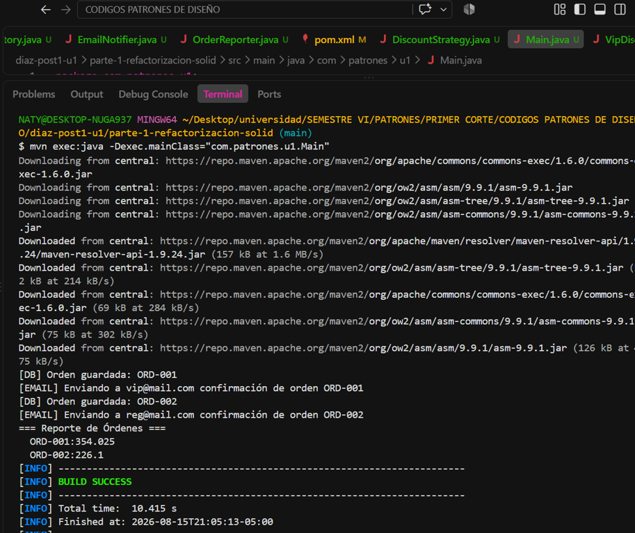
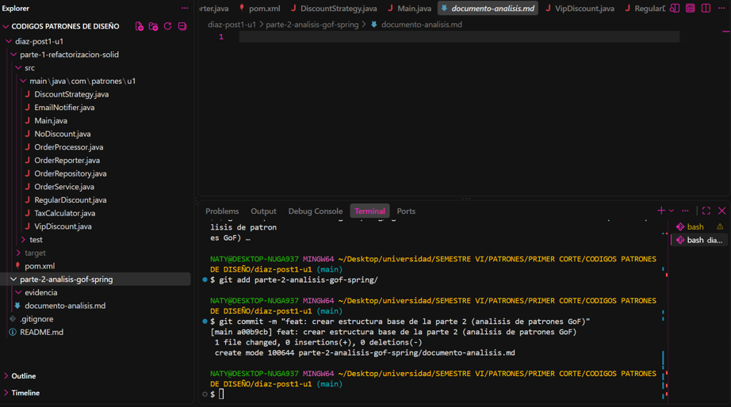

# Evidencias de Código Fuente en Spring Framework (Parte 2)
**Estudiante:** Natalia Díaz Villamizar  
**Repositorio de referencia:** https://github.com/spring-projects/spring-framework

## Checkpoint 1: Repositorio e Historial Inicial
Captura de la terminal ejecutando el comando `git log` para verificar la inicialización del proyecto y los primeros commits.



**Verificación y consulta del alcance Prototype (isPrototype())**
* **Lineas de Referencia:** `489-518`
Este método permite verificar si un bean específico (o el objeto producido por un FactoryBean) está configurado como Prototype, delegando al contenedor padre en caso de jerarquías de beans.

```java
@Override
public boolean isPrototype(String name) throws NoSuchBeanDefinitionException {
    String beanName = transformedBeanName(name);

    BeanFactory parentBeanFactory = getParentBeanFactory();
    if (parentBeanFactory != null && !containsBeanDefinition(beanName)) {
        // No bean definition found in this factory -> delegate to parent.
        return parentBeanFactory.isPrototype(originalBeanName(name));
    }

    RootBeanDefinition mbd = getMergedLocalBeanDefinition(beanName);
    if (mbd.isPrototype()) {
        // In case of FactoryBean, return singleton status of created object if not a dereference.
        return (!BeanFactoryUtils.isFactoryDereference(name) || isFactoryBean(beanName, mbd));
    }

    // Singleton or scoped - not a prototype.
    // However, FactoryBean may still produce a prototype object...
    if (BeanFactoryUtils.isFactoryDereference(name)) {
        return false;
    }
    if (isFactoryBean(beanName, mbd)) {
        FactoryBean<?> fb = (FactoryBean<?>) getBean(FACTORY_BEAN_PREFIX + beanName);
        return ((fb instanceof SmartFactoryBean<?> smartFactoryBean && smartFactoryBean.isPrototype()) ||
                !fb.isSingleton());
    }
    else {
        return false;
    }
}
```

**Control previo a la creación del Prototype (beforePrototypeCreation())**
* **Lineas de Referencia:** `1194-1216`
Este callback registra el bean de alcance prototype como "en proceso de creación" en el hilo actual (ThreadLocal), lo que permite a Spring prevenir y detectar referencias circulares antes de proceder a llamar a `createBean()`.


```java
/**
 * Callback before prototype creation.
 * <p>The default implementation registers the prototype as currently in creation.
 * @param beanName the name of the prototype about to be created
 * @see #isPrototypeCurrentlyInCreation
 */
@SuppressWarnings("unchecked")
protected void beforePrototypeCreation(String beanName) {
    Object curVal = this.prototypesCurrentlyInCreation.get();
    if (curVal == null) {
        this.prototypesCurrentlyInCreation.set(beanName);
    }
    else if (curVal instanceof String strValue) {
        Set<String> beanNameSet = CollectionUtils.newHashSet(2);
        beanNameSet.add(strValue);
        beanNameSet.add(beanName);
        this.prototypesCurrentlyInCreation.set(beanNameSet);
    }
    else {
        Set<String> beanNameSet = (Set<String>) curVal;
        beanNameSet.add(beanName);
    }
}
```


## 2. Patrón Estructural: Proxy
* **Clase:** `org.springframework.aop.framework.ProxyFactoryBean`
* **Lineas de Referencia:** `236-256`
* **Ubicación en GitHub:** `spring-aop/src/main/java/org/springframework/aop/framework/ProxyFactoryBean.java`


`ProxyFactoryBean` actúa como una fábrica de proxies dinámicos en Spring AOP. Tal como indica el propio Java doc oficial de la clase en Spring (`Return a proxy. Invoked when clients obtain beans from this factory bean...`), su método `getObject()` se encarga de instanciar y retornar un objeto proxy envoltorio que intercepta las llamadas para ejecutar lógica adicional (como transacciones o seguridad) antes de invocar la lógica original.

```java
/**
	 * Return a proxy. Invoked when clients obtain beans from this factory bean.
	 * Create an instance of the AOP proxy to be returned by this factory.
	 * The instance will be cached for a singleton, and create on each call to
	 * {@code getObject()} for a proxy.
	 * @return a fresh AOP proxy reflecting the current state of this factory
	 */
	@Override
	public @Nullable Object getObject() throws BeansException {
		initializeAdvisorChain();
		if (isSingleton()) {
			return getSingletonInstance();
		}
		else {
			if (this.targetName == null) {
				logger.info("Using non-singleton proxies with singleton targets is often undesirable. " +
						"Enable prototype proxies by setting the 'targetName' property.");
			}
			return newPrototypeInstance();
		}
	}
```

**Determinación del tipo de clase Proxy (getObjectType())**
* **Lineas de Referencia:** `258-287`
Este método determina el tipo exacto de la clase proxy que se expondrá, resolviendo la clase de forma temprana mediante `createAopProxy()` si la instancia aún no se ha creado.


```java
/**
 * Return the type of the proxy. Will check the singleton instance if
 * already created, else fall back to the proxy interface (in case of just
 * a single one), the target bean type, or the TargetSource's target class.
 * @see org.springframework.aop.framework.AopProxy#getProxyClass
 */
@Override
public @Nullable Class<?> getObjectType() {
    synchronized (this) {
        if (this.singletonInstance != null) {
            return this.singletonInstance.getClass();
        }
    }
    try {
        // This might be incomplete since it potentially misses introduced interfaces
        // from Advisors that will be lazily retrieved via setInterceptorNames.
        return createAopProxy().getProxyClass(this.proxyClassLoader);
    }
    catch (AopConfigException ex) {
        if (getTargetClass() == null) {
            if (logger.isDebugEnabled()) {
                logger.debug("Failed to determine early proxy class: " + ex.getMessage());
            }
            return null;
        }
        else {
            throw ex;
        }
    }
}
```

**Delegación y obtención final del Proxy (getProxy())**
* **Lineas de Referencia:** `345-356`
El método `getProxy()` actúa como el paso final de delegación hacia la abstracción AopProxy (que internamente usará JDK Dynamic Proxies o CGLIB según la configuración).


```java
/**
 * Return the proxy object to expose.
 * <p>The default implementation uses a {@code getProxy} call with
 * the factory's bean class loader. Can be overridden to specify a
 * custom class loader.
 * @param aopProxy the prepared AopProxy instance to get the proxy from
 * @return the proxy object to expose
 * @see AopProxy#getProxy(ClassLoader)
 */
protected Object getProxy(AopProxy aopProxy) {
    return aopProxy.getProxy(this.proxyClassLoader);
}

```


## 3. Patrón de Comportamiento: Chain of Responsibility
* **Clase:** `org.springframework.web.servlet.HandlerExecutionChain`
* **Lineas de Referencia:** `136-152`
* **Ubicación en GitHub:** `spring-webmvc/src/main/java/org/springframework/web/servlet/HandlerExecutionChain.java`

### Descripción
Spring organiza los interceptores en una lista o cadena ordenada (`interceptorList`). Cuando entra una solicitud web, `applyPreHandle()` recorre uno a uno los interceptores. Si alguno retorna `false` (por ejemplo, al fallar una autenticación), la cadena se rompe, detiene el procesamiento y evita que la petición llegue al controlador.

```java
/**
	 * Apply preHandle methods of registered interceptors.
	 * @return {@code true} if the execution chain should proceed with the
	 * next interceptor or the handler itself. Else, DispatcherServlet assumes
	 * that this interceptor has already dealt with the response itself.
	 */
	boolean applyPreHandle(HttpServletRequest request, HttpServletResponse response) throws Exception {
		for (int i = 0; i < this.interceptorList.size(); i++) {
			HandlerInterceptor interceptor = this.interceptorList.get(i);
			if (!interceptor.preHandle(request, response, this.handler)) {
				triggerAfterCompletion(request, response, null);
				return false;
			}
			this.interceptorIndex = i;
		}
		return true;
	}
```

## Checkpoint 8: Compilación y Ejecución en Maven
Captura de la terminal mostrando la ejecución correcta de mvn compile y mvn exec:java.



## Checkpoint 10: Estructura Completa en VS Code
Captura del panel lateral de VS Code con el árbol de directorios desplegado mostrando la distribución del proyecto.




